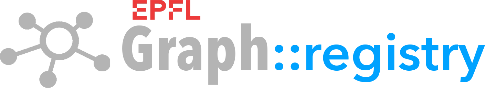

[](https://github.com/epflgraph/graphregistry/blob/master/LICENSE)
[](https://github.com/epflgraph/graphregistry/releases/latest)
[](https://github.com/epflgraph/graphregistry/stargazers)
[](https://github.com/epflgraph/graphregistry/graphs/contributors)
[](https://github.com/epflgraph/graphregistry/commits/master)
[](https://github.com/epflgraph/graphregistry/issues)
[](https://github.com/epflgraph/graphregistry/pulls)
=

🏠 [Project Home](https://github.com/epflgraph/graphproject) > Registry

**List of core services:**<br/>
Registry |
[AI](https://github.com/epflgraph/graphai/tree/rcp_deployment) |
[Ontology](https://github.com/epflgraph/graphontology) |
[Search](https://github.com/epflgraph/graphsearch_ui) |
[Chat](https://github.com/epflgraph/graphchatbot)

**List of utilities:**<br/>
[Dash](https://github.com/epflgraph/graphdashboard) |
[DB client](https://github.com/epflgraph/graphdb-client) |
[ES client](https://github.com/epflgraph/graphes-client) |
[SDK](https://github.com/epflgraph/graph-sdk) |
[Agents](https://github.com/epflgraph/graphagents)

<br />

Overview
========
**Graph Registry** is the first layer in the Graph Platform. It ingests data in JSON format through an ETL pipeline, and generates a knowledge graph that feeds the GraphSearch and GraphChat applications.

Data can be added to the registry through direct JSON file imports, or through a REST API. The actions steps in the knowledge graph construction are executed through a command line interface (CLI).

Installation
============

There are two methods of deploying the Graph Registry application: either with Docker or through a local Python installation. It is recommended you pull the repo first, and experiment with the multiple example scripts available.

In either case, you need to setup the configuration files before you can run the API or the CLI. This is explained in the next section.

## 🐳 Deploy with Docker

Graph Registry is available as a Docker image, which provides a convenient way to deploy the API and run the CLI without needing to set up a local Python environment. The image includes all necessary dependencies and can be easily updated by pulling the latest version from Docker Hub.

Steps to deploy with Docker:

1. Create a `docker-compose.yml` file with the following content:

    ```yaml
    services:
        graphregistry:
            image: epflgraph/graphregistry:latest
            container_name: graphregistry-app
            restart: unless-stopped

            ports:
                - "0493:0493"

            environment:
                GRAPHREGISTRY_ROLE: api
                API_HOST: 0.0.0.0
                API_PORT: 0493
                API_WORKERS: 1
                API_PROXY_HEADERS: 1
                API_FORWARDED_ALLOW_IPS: "*"

            volumes:
                - ./config:/app/config:ro
    ```

    This is the minimal configuration that will deploy and launch the application. A more complete example with HTTPS termination and log shipping is available in:<br />
    📂 [docker/deployment/docker-compose_https+monitor.yml](docker/deployment/docker-compose_https+monitor.yml)

2. Deploy the Registry app and other optional services:

    ```shell
    docker compose up -d
    ```

    If you have a running instance already, you can either execute a soft restart, or force a clean restart as follows:

    ```shell
    docker compose down graphregistry --remove-orphans
    docker rmi epflgraph/graphregistry:latest 2>/dev/null || true
    docker compose pull graphregistry
    docker compose up graphregistry -d --force-recreate
    ```

3. At this point, the API will already be running on the selected port. To run the CLI, you have to execute it inside the container:

    ```shell
    docker compose exec graphregistry graphregistry -h
    ```

To run commands as `graphregistry [cmd]`, add this to your `~/.zshrc` file:

```shell
graphregistry() {
  docker compose exec graphregistry graphregistry "$@"
}
```

Then reload your shell:

```shell
source ~/.zshrc
```

Test with:

```shell
graphregistry test
```

## 👨🏻‍💻 Local installation

For users who prefer to deploy the API and run the CLI directly on their local machine, follow these steps to set up a Python virtual environment and install the package:

1. Clone the repository:

    ```shell
    git clone https://github.com/epflgraph/graphregistry.git
    cd graphregistry
    ```

2. Create and activate a virtual environment:

    ```shell
    python3 -m venv .venv
    source .venv/bin/activate
    ```

3. Install the package:

    ```shell
    pip install .
    ```

4. Verify and test the CLI installation:

    ```shell
    graphregistry -h
    graphregistry test
    ```

5. Deploy the API:

    ```shell
    exec uvicorn graphregistry.entrypoints.api.main:create_app \
        --host 127.0.0.1 \
        --port 9999 \
        --workers 1 \
        --proxy-headers \
        --forwarded-allow-ips 127.0.0.1 \
        --factory
    ```

Once the API is running, the Swagger docs page becomes available here:<br />
🌍 [http://127.0.0.1:9999/docs](http://127.0.0.1:9999/docs)

You can also test it directly on your shell:

```shell
curl -X GET http://127.0.0.1:9999/health 2>/dev/null | jq
```

> [!IMPORTANT]
> Before any of these deployment methods works, you need to setup all required configuration files, as explained in the next section.

Configuration
=============
The Graph Registry application relies on seperate configuration files for each service it leverages or depends on. In addition, there is a number of configuration files governing different parts of the Registry workflow and the knowledge graph construction.

The configuration files should be stored in a folder named `config`. Example templates are provided in the folder: 📂 [config_examples](config_examples)

## Evironment setup

### Graph Registry

The global configuration for the Registry app is defined in: 📂 [config_registry.yml](config_examples/environment/config_registry.example.yml). The content resembles the following:

```yaml
# Title and summary description to be displayed on the API's Swagger page
api:
    title: "GraphRegistry API"
    summary: "HTTP API for Graph data management."

# CLI-related static variables
cli:
  limit_per_type_max: 10000

# Registry database-related configurations
database:

    # Path to folders containing SQL files to be exported, imported, and executed
    sql_paths:
        formulas: "/path/to/database/formulas/"
        exports:  "/path/to/data/exports/"
        patches:  "/path/to/data/patches/"

    # Custom DB schema names on MySQL/MariaDB (for the CREATE DATABASE <schema_name>; command)
    schema_names:
        ontology:                graph_ontology
        registry:                graph_registry
        lectures:                graph_lectures
        airflow:                 graph_airflow
        traversals:              graph_traversals
        elasticsearch_cache:     elasticsearch_cache
        graph_cache_test:        graph_cache
        graph_cache_prod:        graph_cache_prod
        graphsearch_test:        graphsearch_test
        graphsearch_prod:        graphsearch_prod
        graphsearch_prod_mirror: graphsearch_prod_mirror
        graphai_cache_api:       graphai_cache_api

    # Execution mode [dev, prod]
    # In 'dev' mode, data is written to separate DB schemas with the prefix "_1_DEV_", to avoid data being written to production tables.
    mode: dev
```

### MySQL/MariaDB

The configuration for the database connection and GraphDB CLI is defined in: 📂 [config_graphdb.yml](config_examples/environment/config_graphdb.example.yml). Your can define your multiple environments, which you then select with `graphdb --env <env_name>` in the CLI. The content resembles the following:

```yaml
# MySQL client and dump binaries
client_bin: /usr/bin/docker run --rm -i -e=MYSQL_PWD -v /path/to/data:/path/to/data mariadb:VERSION mariadb
dump_bin:   /usr/bin/docker run --rm -i -e=MYSQL_PWD -v /path/to/data:/path/to/data mariadb:VERSION mariadb-dump

# Default export path for database dumps
export_path: /path/to/data/mysql_exports

# Database environments (names must end in '_env')
environments:

  # Core services / test environment
  coresrv_env:
    host_address: HOST_ADDRESS
    port: PORT
    username: USERNAME
    password: PASSWORD
    # If SSL required
    ssl:
      ca: /path/to/ssl/ca-certificates.crt
      verify_server_cert: true

  # Prod environment
  prod_env:
    host_address: HOST_ADDRESS
    port: PORT
    username: USERNAME
    password: PASSWORD
    ssl:
      ca: /path/to/ssl/ca-certificates.crt
      verify_server_cert: true

  # Other environments
  something_else_env:
    host_address: HOST_ADDRESS
    port: PORT
    username: USERNAME
    password: PASSWORD

# Default environment to use when not specified in the GraphDB CLI.
default_env: coresrv_env
```

### ElasticSearch

The configuration for the ElasticSearch connection and GraphES CLI is defined in: 📂 [config_graphes.yml](config_examples/environment/config_graphes.example.yml). Your can define your multiple environments, which you then select with `graphes --env <env_name>` in the CLI. The content resembles the following:

```yaml
# Default export path for index dumps
export_path: /path/to/data/elasticsearch_exports

# ElasticSearch environments (names must end in '_env')
environments:

  # Core services / test environment
  coresrv_env:
    host_address: HOST_ADDRESS
    port: PORT
    username: USERNAME
    password: PASSWORD

  # Prod environment
  prod_env:
    host_address: HOST_ADDRESS
    port: PORT
    username: USERNAME
    password: PASSWORD

  # Other environments
  something_else_env:
    host_address: HOST_ADDRESS
    port: PORT
    username: USERNAME
    password: PASSWORD

# Default environment to use when not specified in the GraphES CLI.
default_env: coresrv_env
```

### Graph AI

The configuration for the GraphAI connection is defined in: 📂 [config_graphai.yml](config_examples/environment/config_graphai.example.yml). The content resembles the following:

```yaml
graphai:
    host_address: HOST_ADDRESS
    port: PORT
    username: USERNAME
    password: PASSWORD
```

### Generative AI [optional]

If you have access to a local or commercial LLM service, which Graph Registry can (optionally) leverage to improve semantic analysis and enrich your raw data, you can configure it in: 📂 [config_genai.yml](config_examples/environment/config_genai.example.yml). The content resembles the following:

```yaml
genai:
    api_key: API_KEY
    inference_url: "https://api.example.com/v1"
    llm_model: "moonshotai/Kimi-K2.7-Code"
```

## Application setup

### Registry API

The configuration for the Graph Registry API is defined in: 📂 [config_api.json](config_examples/application/config_api.example.json). It contains the allowed object types for graph nodes and edges that an API user can insert (more on this in Section #). The content resembles the following:

```json
{
     "allowed-types" : {
        "nodes" : [
            "Course",
            "Lecture",
            "Person",
            "Publication",
            "Unit"
        ],
        "edges" : [
            ["Course", "Person", "teacher"],
            ["Lecture", "Course", "part of"],
            ["Person", "Unit", "accreditation"],
            ["Person", "Unit", "position group ranking"],
            ["Person", "Unit", "position grouping"],
            ["Publication", "Person", "authorship"],
            ["Unit", "Unit", "affiliation"],
            ["Unit", "Unit", "subtype ranking"]
        ]
    }
}
```

### Registry Airflow

The configuration for the Graph Registry airflow mechanism is defined in: 📂 [config_airflow.json](config_examples/application/config_airflow.example.json). It allows you to setup which node and edge object types you want to process on each data refresh cycle (more on this in Section #). The content resembles the following:

```json
{
    "nodes": [
        ["Category", true, true],
        ["Concept", true, true],
        ["Course", true, true],
        ["Lecture", true, true],
        ["Person", true, true],
        ["Publication", true, true],
        ["Unit", true, true]
    ],
    "edges": [
        ["Category", "Category", true],
        ["Category", "Concept", true],
        ["Course", "Lecture", true],
        ["Course", "Person", true],
        ["Person", "Publication", true],
        ["Person", "Unit", true],
        ["Unit", "Unit", true]
    ]
}
```

### Semantic scoring

The configuration for the Graph Registry semantic scoring is defined in: 📂 [config_scores.json](config_examples/application/config_scores.example.json). It allows you to setup which node-to-node tuples you wish to be semantically connected and scored (more on this in Section #). The content resembles the following:

```json
{
    "scored-edge-tuples" : {
        "education" : [
            ["Course", "Course"],
            ["Course", "Lecture"],
            ["Lecture", "Lecture"]
        ],
        "research" : [
            ["Person", "Person"],
            ["Person", "Publication"],
            ["Person", "Unit"],
            ["Publication", "Publication"],
            ["Publication", "Unit"],
            ["Unit", "Unit"]
        ]
    },
    "mixed-scoring-tuples" : [
        ["Category", "Category"],
        ["Course", "Person"],
        ["Person", "Unit"],
        ["Unit", "Unit"]
    ]
}
```

### Indexing setup

The configuration for the Graph Registry indexing setup is defined in: 📂 [config_index.json](config_examples/application/config_index.example.json). It allows you to setup the graph indexing rules for the GraphSearch application and the ElasticSearch index, including which node and edge types to index, which custom fields to include, and how to rank recommendation lists.

The content of this file is too long and complex to display here. You should start with the provided default configuration, and modify it in accordance with your use case as you get more familiar with the format.

Getting Started
===============
Once you set up your environment and application config files, you are ready to execute a full data processing cycle on Graph Registry.

For a test run with the provided sample data, you do not require Graph AI nor Graph Ontology to be deployed. Pre-calculated results and sample sets are provided, allowing you to bypass the deployment of those two services for now.

You can start by testing the CLI as follows:

```shell
graphregistry test
graphregistry -h
```

If everything works as expected, you are good to go! 🚀

> [!TIP]
> You can print the help info for all the CLI commands and sub-commands with `graphregistry <cmd> <subcmd> -h`

## Test your configuration

As a first step, your can validate and check your configuration. The CLI provides the command `config` to execute operations related to your configuration files.

```shell
graphregistry config validate
```

You can also show a pretty-print summary of your configuration files:

```shell
graphregistry config show
```

## Initialize the application environment

If you start from an empty environment, you can run the initialization command to generate all the necessary databases and tables utilized by the Registry application:

```shell
graphregistry init
```

This command assumes the [Graph Ontology](https://github.com/epflgraph/graphontology) has already been imported into your database.

## Ingesting and managing data

There are two ways of inserting data into the Registry database: using the CLI or the API. To help you get started, a sample dataset is provided in the folder: 📂 [examples/sample_sets](examples/sample_sets).

The command for managing Registry data is:

```shell
graphregistry data
```

For example, you can use the subcommand `save` to insert a list of nodes:

```shell
graphregistry data save --node_list examples/sample_sets/sample_epfl_node_list.json
```

and the corresponding list of edges:

```shell
graphregistry data save --edge_list examples/sample_sets/sample_epfl_edge_list.json
```

Alternatively, you can replicate the exact same operation with the API as follows:

```shell
jq '.' examples/sample_sets/sample_epfl_node_list.json \
| curl -sS -X POST 'http://127.0.0.1:9999/api/nodes/save_many' \
    -H 'accept: application/json' \
    -H 'Content-Type: application/json' \
    -d @- \
| jq '.'
```

for the same list of nodes, and the same thing for the edges:

```shell
jq '.' examples/sample_sets/sample_epfl_edge_list.json \
| curl -sS -X POST 'http://127.0.0.1:9999/api/edges/save_many' \
    -H 'accept: application/json' \
    -H 'Content-Type: application/json' \
    -d @- \
| jq '.'
```

You can also use the Swagger UI interface to experiment with data management using the API:<br />
🌍 [http://127.0.0.1:9999/docs](http://127.0.0.1:9999/docs)

You have an example of how to execute each data management operation, using either the CLI or the API, in the folder: 📂 [examples/entrypoints](examples/entrypoints).

For information on the data format, consult the Registry [documentation](https://epflgraph.github.io/graphregistry/).

Airflow Mechanism
=================
Calculating a semantically interconnected knowledge graph is expensive, particularly when the number of academic objects (represented as nodes in the graph) is in the order of hundreds of thousands. For example, a well connected graph with 100'000 nodes can easily have in the order of 10 million edges. Executing a complete graph recalculation every time you insert or delete data would not be feasible.

For this reason, the Registry application has a flexible mechanism - called *Graph Airflow* (inspired by Apache Airflow) - that enables data managers to decide and configure which parts of the graph, and under which conditions, should be (re)calculated.

The Airflow mechanism allows you to:

- select which types of nodes and edges to process;
- impose an upper bound of the number of objects to process in one cycle;
- (re)process only new objects, or otherwise objects for which the checksums have changed;
- (re)process only objects that have expired (based on when they were last processed).

The entire pipeline, from data ingestion to updating and patching the knowledge graph that serves Graph Search in production, is optimized such that only data points that are different (or focibly need to be re-computed) are actually affected.

## Sync new objects

The first action into lauching a knowledge graph refresh cycle (other than inserting and deleting objects) is to sync the current objects in the data registry into airflow, so they start being tracked. You can do this with the command:

```shell
graphregistry airflow sync
```

If you are just starting, you should also sync the ontology objects (concepts and category objects) so they are tracked like any other object:

```shell
graphregistry airflow sync --include_ontology
```

If this is not your first refresh cycle, and every time you begin a new one, it is advisable to start with a clean slate by resetting all cached states across the pipeline:

```shell
graphregistry airflow reset
```

You can later reset the cached states in a more targated manner using the following options:

```shell
graphregistry airflow reset --options typeflags,airflow,traversals,cache
```

For a faster reset action, use the option `--doc_types` to limit to the object type(s) you intend to process.

## Setup the object and content types to process

Graph Airflow allows you to precisely select which node and edge object types to process before you launch a refresh cycle. These are called *type flags* and they are defined in the configuration file: 📂 [config_airflow.json](config_examples/application/config_airflow.example.json).

The format is the following:

```json
{
    "nodes": [
        ["object type 1", process_fields, process_scores],
        ["object type 2", process_fields, process_scores],
        ...
    ],
    "edges": [
        ["object type [from]", "object type [to]", process_fields],
        ["object type [from]", "object type [to]", process_fields],
        ...
    ]
}
```

Where `object type` can take values like `Course`, `Person`, `Lecture`, `Publication`, etc, representing the different types of academic objects managed by your institution.

The type flags are boolean `[true|false]` values representing, in the case of **nodes**:

- `process_fields`: process all metadata fields like title, description, url, and custom (object type-specific) fields;
- `process_scores`: process or re-calculate semantic scores related to (ie, from and to) this object type.

In the case of **edges**:

- `process_fields`: process all metadata related to organizational edges, like, for example, a `Person-to-Publication` authorship relation. The type flag `process_scores` is excluded in this field because it is already covered by the nodes field.

To apply the configuration, run:

```shell
graphregistry airflow config --typeflags config/application/config_airflow.json
```

You can verify the configuration with:

```shell
graphregistry airflow status
```

## Checksums, expiration dates, and subset sizes

To determine if an object needs to be re-processed due to changes in its metadata, like title and description, Graph Airflow relies on object checksums. Therefore, you should always update them at the beginning of a refresh cycle:

```shell
graphregistry airflow update_checksums
```

Note, however, that this operation, and the ones bellow, respect the active type flags. If you want to modify the affected types, be sure to set them in advace with `graphregistry airflow config`.

Another way you can decide whether or not to re-process objects is through expiration dates. If, for example, you consider that semantic connection scores between objects (semantic edges) should be re-calculated after 90 days, you can run:

```shell
graphregistry airflow expire --scores --older_than 90
```

This is useful for discriminating between semantic or organizational edges based on how often they change. For instance, a course description and content might change every academic year, thus requiring frequent semantic analysis, whereas a journal paper typically remains unchanged once it has been published.

Once you set all the conditions under which objects should to be re-processed, you need to update the "to process" states before launching the actual cycle:

```shell
graphregistry airflow refresh --limit_per_type 1000
```

This command will then output and print the precise execution plan for the next stage. You can double check the plan at any time with the command:

```shell
graphregistry airflow status
```

> [!CAUTION]
> Avoid setting `--limit_per_type` too high, as it might overwhelm your MySQL/MariaDB server. It is almost always better to keep that limit low, and execute the refresh cycle multiple times, compared to the opposite.

Knowledge Graph Construction
============================
Once the execution plan has been configured, the next stage is to calculate and construct the **Knowledge Graph**, which is the core structure that represents the essence of the Graph Platform.

## Formulas

The first functionality to master that will enable you to fully benefit from the Graph Registry capabilities is *formulas*. They are described in detail in the [documentation](https://epflgraph.github.io/graphregistry/). For now, it is enough to descriminate formulas into three types:

- formulas related to object metadata fields;
- formulas related to graph traversals;
- formulas related to semantic scores calculation.

In can execute all three types at once (including some intermediate steps) as follows:

```shell
graphregistry cache update --formulas reset,fields,views,traversals,scores --actions commit,eval
```

## Scoring matrix

The two primary results of the previous command are:

1. **Fields:** Consolidation of all object inputs, composed fields, and auto-generated metadata;
2. **Scores:** Consolidation of all object semantic analysis and calculated scores.

Starting with the second, semantic scores are represented by weighted edges of the type `Object-to-Concept` and `Object-to-Category`, where concepts and categories are the basic objects of the [Graph Ontology](https://github.com/epflgraph/graphontology).

Once the link between objects and the concepts ontology has been calculated, the next step is calculate and update the global `Object-to-Object` scoring matrix:

```shell
graphregistry cache update --matrix --actions commit
```

> [!CAUTION]
> This matrix can easily grow to tens of millions of data points - hence the need for processing objects in small chunks.

Serving Graph Search
====================
At this point, the Knowledge Graph is fully defined and up-to-date, and could technically be used to serve a graph-type search client. However, what makes [Graph Search](https://github.com/epflgraph/graphsearch_ui) special compared to other similar systems is how fast and reactive it is. All data is pre-calculated and cached before a user ever uses the search bar or clicks on a link.

## Index database on MySQL/MariaDB

To achieve this level of caching, and yet keep data up-to-date effectively, the Registry has a sophisticated data patching mechanism that introduces minimal changes into the pre-calculated graph database. To execute this patching operation, run the following two commands:

```shell
graphregistry index build --actions commit,eval
graphregistry index patch --actions commit,eval
```

Once data patching has been completed, and assuming it was successful, you should update the object parameters on Graph Airflow, so they are marked as processed and not processed again in the next cycle:

```shell
graphregistry airflow rollover --actions commit
graphregistry airflow update_dates --actions commit
graphregistry airflow reset --options airflow,traversals,cache
```

If you executed multiple refresh and patching cycles, to the point where no objects are left to process under the current configuration, you should do a final clean up of the knowledge graph. It consists of removing all orphan nodes and loose-end edges, as well as small disconnected "island" subgraphs, keeping only the [largest connected graph](https://en.wikipedia.org/wiki/Component_(graph_theory)).

Execute as follows:

```shell
graphregistry data delete_loose_ends --env coresrv --actions eval,commit
```

## Index documents on ElasticSearch

Finally, you can export the Graph Search database index into ElasticSearch, which serves the application's search bar as well as the chatbot functionality. This is done in two steps. First, you export it locally from MySQL/MariaDB:

```shell
graphregistry index generate --target elasticsearch --index_date YYYY-MM-DD -r
```

Then, you import it into your ElasticSearch server:

```shell
graphregistry es import --env coresrv --input_folder path/to/es_exports/YYYY-MM-DD/es_fullindex_YYYY-MM-DD --rename_to graphsearch_dev -r --chunk_size 1000
```

These commands assume you are deploying into a "core services" or "test" environment, since direct patching of data in production is not supported at the moment. In order to deploy your updated database and index into production, you can make direct data copies using the [GraphDB](https://github.com/epflgraph/graphdb-client) and [GraphES](https://github.com/epflgraph/graphes-client) clients respecively.
