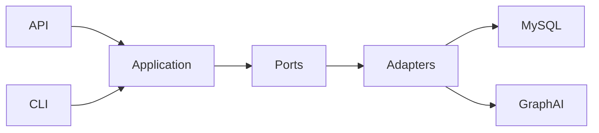

# Graph Registry

GraphRegistry is the first layer of the EPFL Graph Data Platform. It ingests structured data and constructs a semantic knowledge graph that feeds [GraphSearch](https://github.com/epflgraph/graphsearch_ui) and [GraphChat](https://github.com/epflgraph/graphchatbot).

## What it does

- Imports data from JSON files or a REST API.
- Normalises and persists graph **nodes** and **edges**.
- Detects semantic **concepts** with optional AI assistance.
- Manages cache, scores, and airflow flags for incremental rebuilds.
- Builds Elasticsearch indexes for downstream search experiences.

## Platform context

GraphRegistry is one service in the broader Graph Data Platform:

| Service | Role |
|---------|------|
| **GraphRegistry** | Ingestion, persistence, and graph construction (you are here). |
| GraphAI | AI/ML tasks: concept detection, translation, embedding, media processing. |
| GraphOntology | Ontology management and concept hierarchies. |
| GraphSearch | Search UI and recommendation API. |
| GraphChat | Conversational interface over the knowledge graph. |

## Quick links

- [Installation](getting-started/installation.md)
- [Configuration](getting-started/configuration.md)
- [Architecture overview](architecture/overview.md)
- [API reference](api/index.md)
- [CLI reference](cli/index.md)

## Repository

The source code lives at [github.com/epflgraph/graphregistry](https://github.com/epflgraph/graphregistry).
